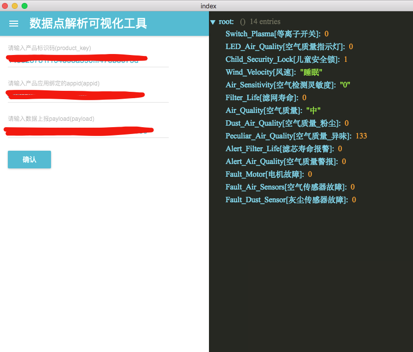

##  说明

本项目是给公司写的一个跨平台IOT 数据点解析工具,只抽取了部分代码，可快速上手开发electron 跨平台桌面程序

##  开发依赖库安装

```
npm  install


```
## 开发调试

```
npm run  dev

```

##  编译打包(选择你自己的平台)

```

npm run publish && npm run build-darwin

```


### 打包各平台

```
electron-packager . --all

```




### 参考文档

*  [electron-react-boilerplate](https://github.com/chentsulin/electron-react-boilerplate)
*  [redux](https://egghead.io/lessons/javascript-redux-the-single-immutable-state-tree?course=getting-started-with-redux)
*  [lodashjs](http://lodashjs.com/docs/)
*  [lodashjs](http://lodash.think2011.net/sum)